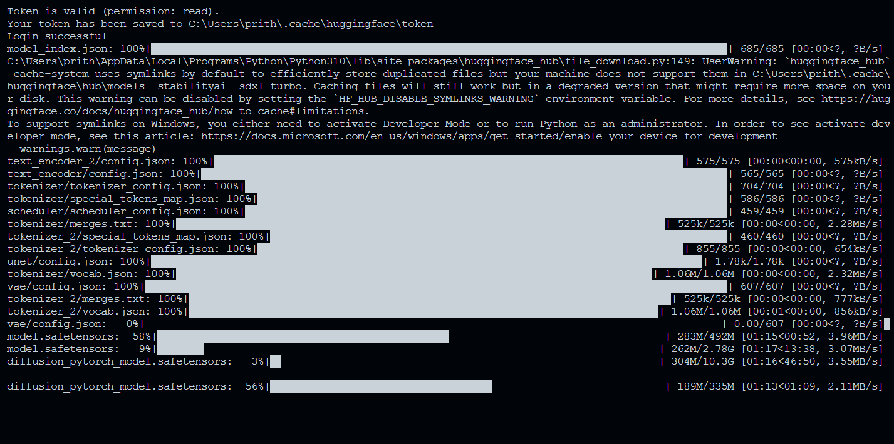
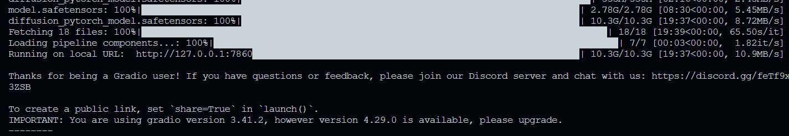
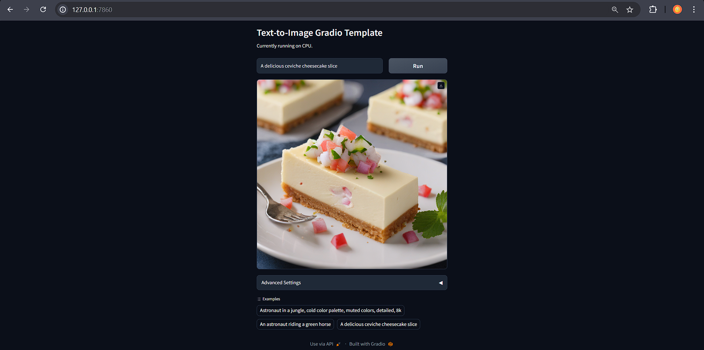

## Working 

    D:\>python app.py 
    Token will not been saved to git credential helper. Pass `add_to_git_credential=True` if you want to set the git credential as well.
    Token is valid (permission: read).
    Your token has been saved to C:\Users\prith\.cache\huggingface\token
    Login successful
    model_index.json: 100%|████████████████████████████████████████████████████████████████████████████████████████████| 685/685 [00:00<?, ?B/s] 
    C:\Users\prith\AppData\Local\Programs\Python\Python310\lib\site-packages\huggingface_hub\file_download.py:149: UserWarning: `huggingface_hub` cache-system uses symlinks by default to efficiently store duplicated files but your machine does not support them in C:\Users\prith\.cache\huggingface\hub\models--stabilityai--sdxl-turbo. Caching files will still work but in a degraded version that might require more space on your disk. This warning can be disabled by setting the `HF_HUB_DISABLE_SYMLINKS_WARNING` environment variable. For more details, see https://huggingface.co/docs/huggingface_hub/how-to-cache#limitations.
    To support symlinks on Windows, you either need to activate Developer Mode or to run Python as an administrator. In order to see activate developer mode, see this article: https://docs.microsoft.com/en-us/windows/apps/get-started/enable-your-device-for-development
      warnings.warn(message)
    text_encoder_2/config.json: 100%|███████████████████████████████████████████████████████████████████████████| 575/575 [00:00<00:00, 575kB/s] 
    text_encoder/config.json: 100%|████████████████████████████████████████████████████████████████████████████████████| 565/565 [00:00<?, ?B/s] 
    tokenizer/tokenizer_config.json: 100%|█████████████████████████████████████████████████████████████████████████████| 704/704 [00:00<?, ?B/s] 
    tokenizer/special_tokens_map.json: 100%|███████████████████████████████████████████████████████████████████████████| 586/586 [00:00<?, ?B/s] 
    scheduler/scheduler_config.json: 100%|█████████████████████████████████████████████████████████████████████████████| 459/459 [00:00<?, ?B/s] 
    tokenizer/merges.txt: 100%|██████████████████████████████████████████████████████████████████████████████| 525k/525k [00:00<00:00, 2.28MB/s] 
    tokenizer_2/special_tokens_map.json: 100%|█████████████████████████████████████████████████████████████████████████| 460/460 [00:00<?, ?B/s] 
    tokenizer_2/tokenizer_config.json: 100%|████████████████████████████████████████████████████████████████████| 855/855 [00:00<00:00, 654kB/s] 
    unet/config.json: 100%|████████████████████████████████████████████████████████████████████████████████████████| 1.78k/1.78k [00:00<?, ?B/s] 
    tokenizer/vocab.json: 100%|████████████████████████████████████████████████████████████████████████████| 1.06M/1.06M [00:00<00:00, 2.32MB/s] 
    vae/config.json: 100%|█████████████████████████████████████████████████████████████████████████████████████████████| 607/607 [00:00<?, ?B/s] 
    tokenizer_2/merges.txt: 100%|█████████████████████████████████████████████████████████████████████████████| 525k/525k [00:00<00:00, 777kB/s] 
    tokenizer_2/vocab.json: 100%|███████████████████████████████████████████████████████████████████████████| 1.06M/1.06M [00:01<00:00, 856kB/s] 
    model.safetensors: 100%|█████████████████████████████████████████████████████████████████████████████████| 492M/492M [02:16<00:00, 3.60MB/s] 
    diffusion_pytorch_model.safetensors: 100%|███████████████████████████████████████████████████████████████| 335M/335M [02:16<00:00, 2.45MB/s] 
    model.safetensors: 100%|███████████████████████████████████████████████████████████████████████████████| 2.78G/2.78G [08:30<00:00, 5.45MB/s] 
    diffusion_pytorch_model.safetensors: 100%|█████████████████████████████████████████████████████████████| 10.3G/10.3G [19:37<00:00, 8.72MB/s] 
    Fetching 18 files: 100%|████████████████████████████████████████████████████████████████████████████████████| 18/18 [19:39<00:00, 65.50s/it] 
    Loading pipeline components...: 100%|█████████████████████████████████████████████████████████████████████████| 7/7 [00:03<00:00,  1.82it/s] 
    Running on local URL:  http://127.0.0.1:7860███████████████████████████████████████████████████████████| 10.3G/10.3G [19:37<00:00, 10.9MB/s] 
    
    Thanks for being a Gradio user! If you have questions or feedback, please join our Discord server and chat with us: https://discord.gg/feTf9x3ZSB
    
    To create a public link, set `share=True` in `launch()`.
    IMPORTANT: You are using gradio version 3.41.2, however version 4.29.0 is available, please upgrade.

Load all the model insights

Compiled & Ready to Launch

Result with the launched default port http://127.0.0.1:7860

.

.

.
